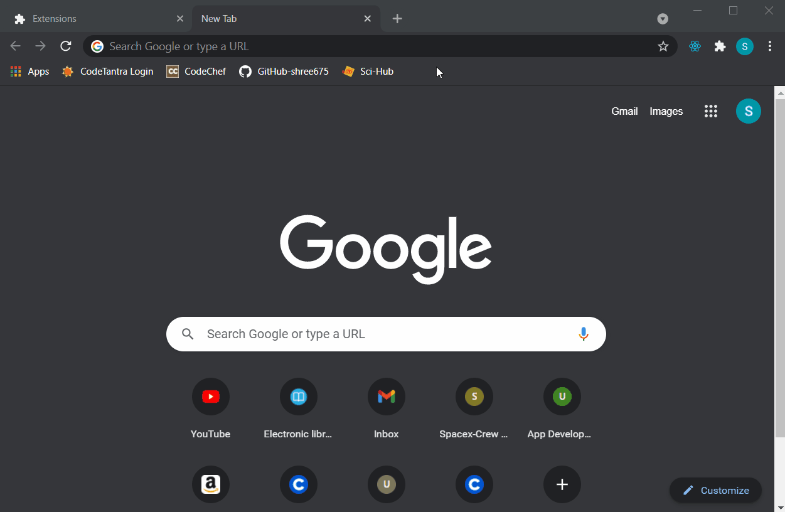

# React-Package-Helper

## About
React Package Helper is a simple Chrome extension that is designed to help users in choosing and browsing different [nmpjs packages](https://docs.npmjs.com/about-packages-and-modules).

## What it does
This extension saves your precious time. In case you are unsatisfied with a react package, then navigating back to the search page and browsing for some more relevant packages may be cumbersome and time consuming. Sometimes, you may also miss a few good react packages in this process, that suit your needs.  
You may want to save your time while not losing continuity in the hunt for your react package that suits your needs.  
React Package Helper does exactly that. It comes to your rescue by providing a list of five most relevant react packages other than the one that you are already browsing through. On clicking a particular option of interest, it takes you to the documentation page of that package.

***Note: This extension works only in the official npmjs web pages that contain packages.***

## Demonstration

This extension has been developed as a personal tool to suit my needs and to save my time while browsing for ReactJS and NodeJS packages.

## Screenshots
For screenshots and videos, visit [assets](assets).

## Version
v1.0
