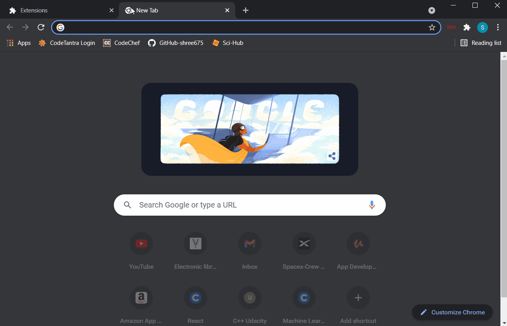

# npm-Package-Helper

## About

npm Package Helper is a simple Chrome extension that is designed to help users in choosing and browsing different [npmjs packages](https://docs.npmjs.com/about-packages-and-modules).

## What it does

This extension saves your precious time. While using any framework, in case you are unsatisfied with an npm package, then navigating back to the search page and browsing for some more relevant packages may be cumbersome and time consuming. Sometimes, you may also miss a few good packages, in this process, that suit your needs.  
You may want to save your time while not losing continuity in the hunt for your npmjs package that suits your needs.  
npm Package Helper does exactly that. It comes to your rescue by providing a list of five most relevant packages other than the one that you are already browsing through. On clicking a particular option of interest, it takes you to the documentation page of that package.

**_Note: This extension only works in npmjs web pages that contain npmjs packages._**

## Demonstration

This extension has been developed as a personal tool to suit my needs and to save my time while browsing for React.js and Node.js packages.

## Screenshots

For screenshots and videos, visit [assets](assets).

## Version

v1.0
